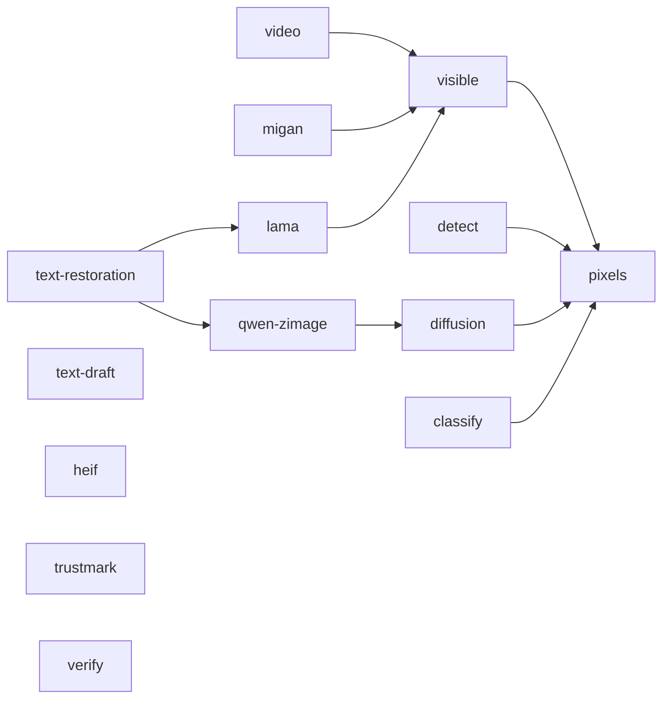

# Installation

Python 3.11 through 3.14 are supported.

## Default metadata mode

The default package provides:

- provenance inspection;
- AI metadata inspection and removal.

It installs Pillow, piexif, and c2pa-python for reading metadata directly from
files. It does not install NumPy, OpenCV, pillow-heif, Torch, diffusion models,
or invisible-watermark decoders.

Install it as an isolated command with uv:

```bash
uv tool install remove-ai-watermarks
```

Or with pipx:

```bash
pipx install remove-ai-watermarks
```

You can also install the Homebrew package on macOS or Linux:

```bash
brew install wiltodelta/tap/remove-ai-watermarks
```

## Visible watermark removal

Visible mark detection, OpenCV inpainting, and manual region erasing need the
`visible` extra:

```bash
uv tool install --force "remove-ai-watermarks[visible]"
```

Add `heif` only when the pixel path must decode HEIC, HEIF, or AVIF:

```bash
uv tool install --force "remove-ai-watermarks[visible,heif]"
```

## Video processing

Video metadata inspection works with the default package, and MP4 and MOV
stripping uses the in-tree ISOBMFF box walker. Stripping the non-ISOBMFF
containers (MKV, WebM, AVI, FLV, and the audio formats) and writing any cleaned
video need ffmpeg on PATH, for example `brew install ffmpeg`. Stable
visible-mark identification and removal, full video cleaning, and visible/all
batch modes need the `video` extra:

```bash
uv tool install --force "remove-ai-watermarks[video]"
```

The extra includes the visible pixel runtime and PyAV for preserving variable
frame timestamps. Video SynthID regeneration also needs the diffusion stack:

```bash
uv tool install --force "remove-ai-watermarks[video,diffusion]"
```

## Invisible watermark removal

Install the `qwen-zimage` extra:

```bash
uv tool install --force "remove-ai-watermarks[qwen-zimage]"
```

Both remaining profiles run a Z-Image face stage on the DiffSynth runtime, so
both need this extra. The third profile, `chroma-zimage`, uses diffusers'
ChromaImg2ImgPipeline instead of DiffSynth for its global stage but inherits
the same face stage, so it needs this extra too. It includes the `diffusion`
dependencies; `diffusion` on its own covers the torch and diffusers imports
but not the face stage, so it is not enough to run a removal.

**An NVIDIA GPU is required.** `qwen-zimage`, `sdxl-zimage` and `chroma-zimage`
are CUDA-only, and
construction refuses any other device rather than falling back to a slow or broken
one. There is no CPU, MPS or XPU path for invisible-watermark removal. Visible-mark
removal, metadata stripping and every `identify` command still run anywhere.

Video SynthID regeneration is a separate VAE path and does still run on CPU or MPS;
it needs the `diffusion` extra, not this one.

The experimental verified-text post-pass additionally needs LaMa:

```bash
uv tool install --force "remove-ai-watermarks[text-restoration]"
```

That extra includes `qwen-zimage` and `lama`; it does not add OCR. Text strings and
line boxes must be reviewed before the run.

## Feature extras

Extras are composable. Install only the capabilities and file formats the
application actually uses:

| Extra | Capability | Automatically includes | Torch or model download |
| --- | --- | --- | --- |
| `pixels` | Shared BGR runtime and calibrated-size SynthID carrier detection | NumPy, headless OpenCV | No |
| `heif` | HEIC, HEIF, and AVIF pixel decoding | pillow-heif | No |
| `visible` | Visible mark detection, OpenCV inpainting, and manual erasing | `pixels` | No |
| `video` | Visible video identification/removal and timestamp preservation | `visible`, PyAV | No |
| `detect` | Open DWT-DCT detection for Stable Diffusion, SDXL, and FLUX | `pixels`, PyWavelets | No |
| `trustmark` | Adobe TrustMark detection on Python 3.11-3.12 | trustmark | Yes |
| `classify` | Metadata-free photo AI-versus-camera classifier plus gated provider | `pixels`, Torch, Transformers | Yes |
| `verify` | Official remote OpenAI SynthID verification | OpenAI SDK | No |
| `diffusion` | Torch and Diffusers runtime; video SynthID regeneration | `pixels`, Torch, Diffusers | Yes |
| `migan` | MI-GAN ONNX fill backend | `visible`, ONNX Runtime | Model download, no Torch |
| `lama` | big-LaMa ONNX fill backend | `visible`, ONNX Runtime | Model download, no Torch |
| `qwen-zimage` | Invisible image-watermark removal, all CUDA-only profiles | `diffusion`, DiffSynth | Yes |
| `text-restoration` | Opt-in verified profile-VAE glyph restoration | `qwen-zimage`, `lama` | Yes |
| `text-draft` | Draft OCR proposals for operator verification | PaddleOCR, PaddlePaddle | Model download, no Torch |
| `all` | Every production feature available on the active Python | All compatible rows above | Yes |
| `dev` | Tests, linting, typing, and upstream parity checks | `video`, `detect`, upstream invisible-watermark | Yes, for parity tests |

Dependency composition:



`heif`, `trustmark`, `verify`, and `text-draft` are independent branches. Combine them
explicitly with another feature when required. `text-draft` is excluded from
`all` because it proposes unverified OCR annotations and is not a production
removal path. TrustMark requires NumPy 1.x, which has no
CPython 3.13 or 3.14 wheels, so that branch is available only on Python
3.11-3.12. The `all` bundle contains every production branch compatible with
the active Python and never includes `dev`.

Examples:

```bash
# Metadata plus torch-free DWT-DCT detection
uv tool install --force "remove-ai-watermarks[detect]"

# Visible removal with HEIC/AVIF support and MI-GAN
uv tool install --force "remove-ai-watermarks[migan,heif]"

# Visible video removal with preserved timestamps
uv tool install --force "remove-ai-watermarks[video]"

# DWT-DCT and TrustMark detection without diffusion removal
uv tool install --force "remove-ai-watermarks[detect,trustmark]"

# Official OpenAI SynthID verification
uv tool install --force "remove-ai-watermarks[verify]"

# Every production capability compatible with this Python
uv tool install --force "remove-ai-watermarks[all]"

# An arbitrary minimal combination
uv tool install --force "remove-ai-watermarks[migan,detect]"
```

`heif` stays independent so applications that only process PNG, JPEG, or WebP
do not install libheif. `detect` uses the in-tree torch-free decoder and does
not install the upstream `invisible-watermark` package. Optional models download
their weights on first use.

The `verify` extra makes an explicit remote request. The
`verify-openai-synthid` command first removes AI provenance metadata from a
temporary copy, checks that its decoded pixels are unchanged, and then uploads
that copy to OpenAI. It needs `OPENAI_API_KEY`; the command never runs from
`identify` and refuses to upload without `--acknowledge-upload`. The Python API
requires the equivalent explicit `acknowledge_upload=True` argument.

The old `gpu` and `remove` aliases are intentionally not provided. Use
`diffusion` and `visible` respectively.

## Install from the repository

```bash
git clone https://github.com/wiltodelta/remove-ai-watermarks.git
cd remove-ai-watermarks
uv sync --frozen
```

Add the feature groups required for your work:

```bash
uv sync --frozen --extra dev
uv sync --frozen --extra dev --extra diffusion
```

Run commands from the repository root:

```bash
uv run remove-ai-watermarks --help
```

## Development setup

Install development dependencies:

```bash
uv sync --frozen --extra dev
```

Run the complete project gate:

```bash
bash maintain.sh
```

The script syncs every optional backend on top of the `dev` environment above,
then runs dependency checks, linting, formatting, type checking, and the test
suite. It applies Ruff fixes and formatting in place rather than only reporting
them.

## Hugging Face authentication

Pass a Hugging Face token directly when the selected model or account requires
one:

```bash
remove-ai-watermarks invisible image.png --hf-token "$HF_TOKEN"
```

The CLI also loads `HF_TOKEN` from the environment and from a local `.env`
file. The same name is documented in `.env.example`.

## Troubleshooting

### The first model run is slow

Diffusion and learned fill backends may download model weights on first use.
Later runs reuse their caches.

### The command skips invisible removal

The normal behavior is to skip diffusion when no supported local signal is
found. A missing signal does not prove that the image is clean. If you know the
image came from a relevant generator, use `--force`.

If the CLI reports that the removal dependencies are unavailable, install the
`qwen-zimage` extra. `diffusion` alone covers Torch and Diffusers but not the
DiffSynth face stage that all profiles run. Video SynthID removal is a separate
path and needs `video` and `diffusion`.
