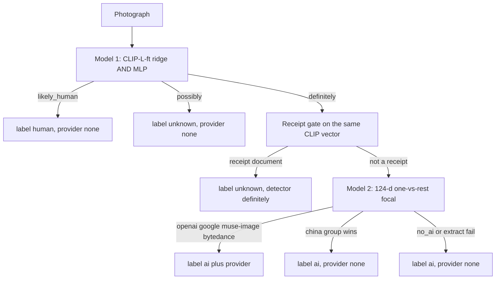

---
language:
  - en
license: apache-2.0
library_name: transformers
pipeline_tag: image-classification
base_model: openai/clip-vit-large-patch14
inference: false
tags:
  - clip
  - image-classification
  - ai-generated-content
  - photo
  - provider-attribution
datasets:
  - detection-datasets/coco
---

# Photo AI-versus-camera classifier

Two heads, one call. Model 1 decides whether a **photograph** looks generated
or camera-like. Model 2 names a provider only after Model 1 is DEFINITELY AI.

This is not a SynthID decoder. It is not provenance. It is not a universal
"AI or not" detector for UI or digital art. Receipt photographs are
detected by the bundled receipt gate and abstain to `unknown` rather than
a false `ai`. The Python package
[`remove-ai-watermarks`](https://github.com/wiltodelta/remove-ai-watermarks)
loads these files through an explicit `classify` extra. `identify` never
starts this model, including after a no-signal metadata scan.

Library guide:
[photo pixel classification](https://github.com/wiltodelta/remove-ai-watermarks/blob/main/docs/photo-classify.md).
Research archive:
[AI-generated image classifiers](https://github.com/wiltodelta/remove-ai-watermarks/blob/main/docs/ai-generated-image-classifiers.md).
The demo Space
[`wiltodelta/remove-ai-watermarks`](https://huggingface.co/spaces/wiltodelta/remove-ai-watermarks)
is a watermark-removal UI, not this classifier.

The training catalog is not in this Hub repository and is not on GitHub.

## Intended use

Use it when you have a photographic still and you want a pixel opinion after
metadata is gone:

- `label=ai` plus `provider=openai|google|bytedance|muse-image` on a stripped ChatGPT,
  Gemini, ByteDance (Doubao/Jimeng), or Muse Image photograph; a stripped
  photograph from the rest of China's generators (Qwen, Kling, ...)
  publishes `provider=None` (the residual head abstains)
- `label=human` on camera photographs at a low false-positive rate
- `label=unknown` when the detector is only POSSIBLY AI, or when 124-d
  features cannot be extracted

Do not use it to assert that a file is clean. Do not use it as a legal
authorship test. Do not run Model 2 on every image.

## Approach

Content embeddings and forensic residuals answer different questions.

CLIP-L, after a light vision-block fine-tune, separates **generated
photographs** from **camera photographs**. It does not reliably separate
generated photographs from UI, charts, or illustration; receipts live
inside the AI region too, which is why the shipped receipt gate (below)
abstains them on the DEFINITELY path instead of trying to fix Model 1. A
ridge trained on that embedding at a 1% Open Images false-positive cut is
the strongest Model 1 we measured. A small MLP on the same vectors, ANDed
with the ridge, is the freeze DEFINITELY gate.

The receipt gate ships in this repository alongside the freeze files, so
it versions with the embedding space it was fitted on. Since 2026-09-07
the artifact carries the STABLE name `receipt-gate.npz` with the
threshold inside, so head and operating point move together and a gate
update needs no library release; the legacy dated spelling stays
readable, and the Python package carries a fallback copy for weights
directories frozen before the gate existed.

The 124-d bank is a different feature: patch-local residual ratios (FFT band
energy, comb contrast, autocovariance) on 256 px tiles. On that bank, OpenAI
versus Gemini is easy (AUC 0.989 in the research sweep) while "AI or not" is
the wrong job. Firefly and PixelBin sit near Google on those residuals, which
is why a provider finder must keep foreign generators in the test and must
abstain.

The two heads therefore stay specialized:



CLIP content space is the wrong place to train "UI versus rest" if the
product contract is photographic; that domain remains open. For receipts a
narrower question is solvable in CLIP space: receipts versus AI on the
DEFINITELY path separates perfectly, and the bundled receipt gate (linear
head, CORD-v2 train plus synthetic capture-style positives, threshold
certified on held-out validation) answers it. It abstains to `unknown`;
it is not a receipt-versus-rest specialist and adds no provider class.

Provider attribution tracks the **renderer**, not the front-end. Bing Image
Creator rows signed Microsoft, OpenAI score as `openai`. Designer rows signed
Microsoft, Google LLC score as `google`. Native Designer is mixed. There is
no Microsoft pixel class -- measured 2026-09-07: a head trained on
Microsoft-brand rows recognizes 8% of its own test cell, and Microsoft
attribution stays a metadata (C2PA) job. `openai` and `google` are provider classes.
`muse-image` is Muse Image output, not a general Meta class. Instagram
`made_with_ai` is not that class. `bytedance` names the shared
ByteDance generator lineage: Doubao and Jimeng render with one model
family (separate heads cross-fire even at 3.5x train mass; the union
holds 83.9% on the frozen test cell). `tc260` covers the REST of China's
generator ecosystem -- producers that are peers of openai/google/meta;
no mixed head can honestly name that group, so its win abstains.

## Architecture

### Model 1

- Backbone: `openai/clip-vit-large-patch14`
- Fine-tune: last two vision blocks, visual projection, post-layernorm
- Preprocess: 224 letterbox, pad RGB `(123, 117, 104)`, BICUBIC, L2-normalized
  `get_image_features` (`pooler_output` when present)
- Ridge: linear probe on 768-d vectors, threshold `thr_oi_1pct` = 0.3056
  from the locked `photo_dev_oi` 1% cut
- MLP: `768-512-128-1` with dropout 0.3 / 0.1, threshold 5.9586, 1.67%
  photo-dev quantile
- DEFINITELY = ridge AND MLP. POSSIBLY = either. The public `label` is `ai`
  only on DEFINITELY.

### Model 2

- Input: 124-d residual vector, or abstain if the image is smaller than
  256 px or the extractor refuses
- Heads: one-vs-rest focal MLP `124-64-1` per class
  (`openai`, `google`, `tc260`, `meta_muse_image`, `no_ai`)
- Decision: a class wins only if it beats `no_ai` by margin 0.30, then argmax
  among those that passed
- Public name `muse-image` is the Muse Image class. The freeze file still
  keys that head `meta_muse_image`. `bytedance` is the shared
  Doubao+Jimeng generator lineage. `tc260` covers the rest of China's
  generator ecosystem; no mixed head can honestly name the group, so its
  argmax win publishes `provider=None`. `no_ai` is not reported as
  `human`; it becomes `provider=None` on an `ai` label (for example FLUX)

## Training

CPU. Two consecutive freeze runs from the same catalog and caches were
byte-identical.

| Item | Value |
| --- | --- |
| Catalog identity | sha256 of file bytes, 32,690 listed files |
| CLIP-L embeddings keyed | 26,573 |
| Detector seed | 20260940 |
| Provider seed | 20260956 |
| Sample seed for provider OpenAI/Google draws | 20260821 |
| MLP epochs / width | 40 / 512 |
| Provider focal gamma / epochs | 2.0 / 40 |
| Private UI in train | 0. Replaced with 150 CC Flickr screenshots via Openverse, host `live.staticflickr.com` only |

Flickr licenses in that replacement cell: CC BY 2.0 42, CC BY-NC 2.0 42,
CC BY-SA 2.0 29, CC BY-NC-SA 2.0 28, CC BY-NC-ND 2.0 6, CC BY-ND 2.0 2,
CC0 1.

The pixel catalog is **not published on the Hub**. Head retrain uses
sha256-keyed CLIP-L and 124-d caches plus `catalog.json` roles. The original
files remain stored privately so embeddings and 124-d features can be rebuilt.
Public named sources in those roles include COCO, Open Images, Kodak, Picsum,
Hugging Face FLUX, Openverse CC Flickr, and Meta Muse API hold-out v3.
In-house labeled OpenAI, Gemini, and TC260 photographs stay private. See
[photo-classify-training.md](https://github.com/wiltodelta/remove-ai-watermarks/blob/main/docs/photo-classify-training.md).

## Evaluation (run 1 = run 2)

DEFINITELY is the shipped operating point.

| Head | Cell | Result |
| --- | --- | ---: |
| Detector DEFINITELY | AI-test | 92.4% (n=1,847) |
| Detector DEFINITELY | Open Images fresh | 1.3% (n=3,000) |
| Detector DEFINITELY | Kodak | 0/24 |
| Detector DEFINITELY | FLUX hold | 83.0% (n=300) |
| Class | OpenAI test | 90.8% (345/380 of 381) |
| Class | Google test | 90.9% (339/373 of 377) |
| Class | Bytedance test (Doubao+Jimeng) | 83.9% (271/323; 83.6% extended with the historical harvest) |
| Class | Muse Image hold-out v2 | 85.7% (66/77 listed 79) |
| Class | Muse Image hold-out v3 | 89.4% (177/198) |
| Class | Muse Image hold-out pooled | 88.4% (243/275 listed 277) |
| Class | meme templates, ungated | 29.1% leak (86 of 97) |

The ungated meme leak is why Model 2 must not run on every file. Gated on
DEFINITELY, that leak is not a provider attribution.

Ridge-only Model 1 at the earlier 1% Open Images cut (before the AND with
the freeze MLP) is documented in the research page: Kodak 0/24, fresh 1.7%,
AI-test 93.0%, FLUX 92.7%, Firefly 94.0%. Nobody in that sweep hit both
≤1% fresh FPR and ≥90% TPR. The freeze AND is stricter on photos (1.3%
DEF) at a small recall cost.

## Limitations

- **Photographs only.** UI, scans of forms, maps, and community digital art
  sit in the AI region of CLIP-L. Receipt photographs are abstained by the
  2026-09-02 receipt gate: they report `unknown` with `detector=definitely`
  instead of a false `ai` (field false-AI fell from 19/59 to 2/59, CORD
  89/99 to 0/99, at a 7/1,847 ai_test cost). A photorealistic AI receipt
  can still score as `human`.
- **Not SynthID.** A `provider=openai` result means the pixels look like an
  OpenAI-rendered photograph, not that a payload was decoded.
- **Not provenance.** C2PA, IPTC, and visible marks stay on `identify`.
- **124-d can refuse.** Some sizes and some images yield no vector. The
  detector can still return DEFINITELY; provider is then `None`.
- **Microsoft has no head.** Route by renderer, or use C2PA for the
  front-end name.
- **Open-world generators.** FLUX is a hold-out at 83% DEF, not 100%.
  Unknown generators may land on `ai` with `provider=None`, or miss
  DEFINITELY.
- **`bytedance` is one lineage, not two products.** Doubao and Jimeng
  render with one ByteDance model family, so the class names the lineage.
  The residual China head (`tc260`: Qwen, Yuanbao, Kling, ...) never
  publishes a value; per-producer classes return by `ContentProducer`
  when their train mass holds its own cells (qwen at 64 train rows:
  27%, stays in the fallback).

## How to use

Install the extra. First call downloads this repository into the Hugging
Face cache, or reads `RAIW_CLASSIFY_WEIGHTS` if you already have the files.

```bash
uv tool install --force "remove-ai-watermarks[classify]"
remove-ai-watermarks classify image.png
```

```python
from pathlib import Path
from remove_ai_watermarks.classify import classify_pixels

result = classify_pixels(Path("image.png"))
# result.label, result.detector, result.provider
```

`device` is a library parameter (`None` / `"auto"` / `"cpu"` / `"cuda"`),
not a CLI option. Pin a Hub revision in production so a later upload cannot
silently change the heads.

## Files in this repository

| File | Role |
| --- | --- |
| `clip-l-ft.pt` | HeadedCLIP state dict (CLIP-L plus unused linear head) |
| `probe-weights-clip-l-ft.npz` | Ridge mean, scale, weights, `thr_oi_1pct` |
| `detector.pt` | Freeze MLP |
| `provider.pt` | Focal heads keyed `openai`, `google`, `tc260`, `meta_muse_image`, `no_ai` |
| `operating-point.json` | Seeds, thresholds, margin |

The image catalog is not in this repository.

## License

Apache-2.0 for the trained heads and this card. CLIP-L inherits its upstream
license from [`openai/clip-vit-large-patch14`](https://huggingface.co/openai/clip-vit-large-patch14).
Flickr replacement images are CC-licensed per file; they are not redistributed
here.

## Citation

Package [`remove-ai-watermarks`](https://github.com/wiltodelta/remove-ai-watermarks).
Protocol and rejected variants: [docs/ai-generated-image-classifiers.md](https://github.com/wiltodelta/remove-ai-watermarks/blob/main/docs/ai-generated-image-classifiers.md).
Provider renderer study: [docs/synthid-classifiers.md](https://github.com/wiltodelta/remove-ai-watermarks/blob/main/docs/synthid-classifiers.md).
