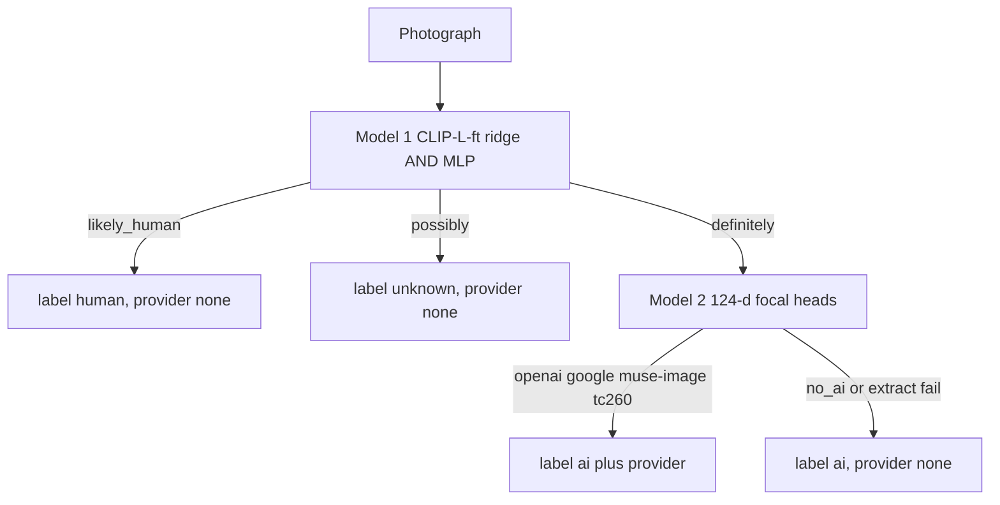

# Photo pixel classification

`classify` gives a pixel opinion on a **photograph**: camera-like, generated,
or unknown, and optionally which renderer it resembles. It is a separate
command from `identify`. Metadata inspection never starts it.

This page is the library guide. The Hugging Face model card is the same freeze
written for Hub publication: [photo-classify-hf/README.md](photo-classify-hf/README.md).
Campaign notes and rejected variants live in
[AI-generated image classifiers](ai-generated-image-classifiers.md).

## When to use it

Use `identify` for C2PA, IPTC, visible marks, and other provenance. Use
`classify` when those signals are gone and the file is still a photograph.

Do not use `classify` to prove a file is clean. Do not use it on receipts, UI,
or digital art. Do not treat `provider=openai` as a decoded SynthID payload.

## Install and run

```bash
uv tool install --force "remove-ai-watermarks[classify]"
remove-ai-watermarks classify image.png
remove-ai-watermarks classify image.png --json
```

```python
from pathlib import Path
from remove_ai_watermarks.classify import classify_pixels

result = classify_pixels(Path("image.png"))
print(result.label, result.detector, result.provider)
```

Missing extra raises `RuntimeError` with
`pip install 'remove-ai-watermarks[classify]'`. `device` is a library
parameter (`None` / `"auto"` / `"cpu"` / `"cuda"`), not a CLI option.

Weights are not in git. First call downloads
[`wiltodelta/raiw-models`](https://huggingface.co/wiltodelta/raiw-models)
at the freeze revision pinned in `classify.py`, or reads
`RAIW_CLASSIFY_WEIGHTS` if that directory already has `clip-l-ft.pt`,
`probe-weights-clip-l-ft.npz`, `detector.pt`, and `provider.pt`. The training
catalog is not published with the package.

## What one call returns

One request runs both heads. Model 2 runs only after Model 1 is DEFINITELY.



| Field | Values | Meaning |
| --- | --- | --- |
| `label` | `ai`, `human`, `unknown` | Public verdict. `ai` only on DEFINITELY |
| `domain` | `photo` | This freeze is photographic only |
| `detector` | `definitely`, `possibly`, `likely_human` | Raw Model 1 gate |
| `provider` | `openai`, `google`, `muse-image`, `tc260`, or `None` | Model 2, only if `label` is `ai` |

`human` is camera-like under this contract, not a proof of authorship.
`unknown` is POSSIBLY, or a domain this freeze does not support. `provider=None`
on an `ai` file is often FLUX or another generator that is not one of the four
heads, or a 124-d extract refusal.

## Approach

CLIP-L content embeddings separate generated photographs from camera
photographs. They do not separate generated photographs from receipts or UI.
A ridge on fine-tuned CLIP-L (last two vision blocks, 224 letterbox) is Model
1. A small MLP on the same vectors, ANDed with the ridge, is the freeze
DEFINITELY gate.

Provider attribution uses a different feature: 124-d residual ratios on 256 px
patches. OpenAI versus Gemini is a strong split there. "AI or not" is the
wrong job on that bank, which is why Model 2 is gated.

Provider names the renderer, not the product UI. Bing Image Creator signed
Microsoft, OpenAI scores `openai`. Designer signed Microsoft, Google LLC
scores `google`. There is no Microsoft pixel class. `openai` and `google` are
provider classes. `muse-image` is Muse Image output, not a general Meta
class. `tc260` is the China AIGC label standard, not one producer: Doubao,
Jimeng, Qwen, Kling, and others share that residual class.

## Evaluation

Two CPU retrains were byte-identical. DEFINITELY is the shipped cut.

| Head | Cell | Result |
| --- | --- | ---: |
| Detector DEFINITELY | AI-test | 92.4% (n=1,847) |
| Detector DEFINITELY | Open Images fresh | 1.3% (n=3,000) |
| Detector DEFINITELY | Kodak | 0/24 |
| Detector DEFINITELY | FLUX hold | 83.0% (n=300) |
| Class | OpenAI | 90.8% (345/380 of 381) |
| Class | Google | 90.9% (339/373 of 377) |
| Class | TC260 | 78.6% (298/379 of 384) |
| Class | Muse Image hold-out v3 | 89.4% (177/198) |
| Class | Muse Image hold-out pooled | 88.4% (243/275 listed 277) |
| Class | meme templates, ungated | 29.1% leak |

The ungated meme row is why Model 2 never runs on `human` or `unknown`.

## Limits

- Receipts, UI, scans, maps, and community art are out of contract.
- Not SynthID, not C2PA, not `is_ai_generated`.
- Images under 256 px cannot yield 124-d features, so provider abstains.
- FLUX is a hold-out at 83% DEF, not a named provider class.
- `tc260` is mixed producers under one label standard. A later retrain
  should split it by manufacturer.

`identify`, `has_invisible_target`, `all`, and `invisible` do not import this
module. A no-signal provenance result stays unknown until you call `classify`
yourself.

Training data, the retrain pack (caches only, no images), and
`scripts/retrain_photo_classify.py` are in
[photo-classify-training.md](photo-classify-training.md).
