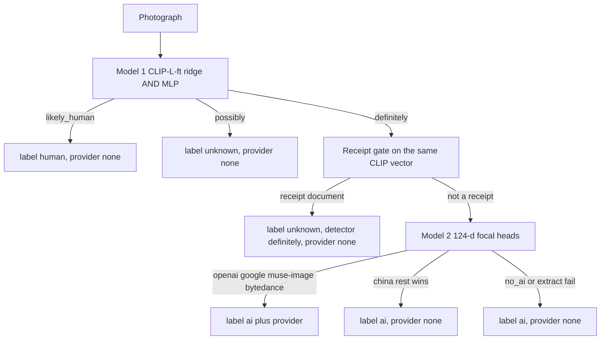

# Photo pixel classification

`classify` gives a pixel opinion on a **photograph**: camera-like, generated,
or unknown, and optionally which renderer it resembles. It is a separate
command from `identify`. Metadata inspection never starts it.

This page is the library guide. The Hugging Face model card is the same freeze
written for Hub publication: [photo-classify-hf/README.md](photo-classify-hf/README.md).
Campaign notes and rejected variants live in
[AI-generated image classifiers](ai-generated-image-classifiers.md).

## When to use it

Use `identify` for C2PA, IPTC, visible marks, and other provenance. Use
`classify` when those signals are gone and the file is still a photograph.

Do not use `classify` to prove a file is clean. Do not use it on UI or
digital art. Receipt photographs are detected by the receipt-document gate
and abstain to `unknown` instead of a false `ai`; they are still not a
supported verdict. Do not treat `provider=openai` as a decoded SynthID
payload.

## Install and run

```bash
uv tool install --force "remove-ai-watermarks[classify]"
remove-ai-watermarks classify image.png
remove-ai-watermarks classify image.png --json
```

```python
from pathlib import Path
from remove_ai_watermarks.classify import classify_pixels

result = classify_pixels(Path("image.png"))
print(result.label, result.detector, result.provider)
```

Missing extra raises `RuntimeError` with
`pip install 'remove-ai-watermarks[classify]'`. `device` is a library
parameter (`None` / `"auto"` / `"cpu"` / `"cuda"`), not a CLI option. The
explicit `backend="onnx"` path is CPU-only and requires
`clip-l-ft-vision-fp32.onnx` in `RAIW_CLASSIFY_WEIGHTS`; PyTorch remains the
default until that artifact is published in the pinned Hub snapshot. Install
the experimental runtime with `pip install 'remove-ai-watermarks[classify-onnx]'`.

Weights are not in git. First call downloads
[`wiltodelta/raiw-photo-classify`](https://huggingface.co/wiltodelta/raiw-photo-classify)
at the freeze revision pinned in `classify.py`, or reads
`RAIW_CLASSIFY_WEIGHTS` if that directory already has `clip-l-ft.pt`,
`probe-weights-clip-l-ft.npz`, `detector.pt`, and `provider.pt`. The training
catalog is not published with the package. Deployments that pre-cache the
snapshot for offline resolution must request exactly
`classify.WEIGHTS_ALLOW_PATTERNS`. That exported list covers both backends;
the online runtime narrows its download to the selected model plus the shared
heads. A partial offline pre-cache fails resolution, even for files the runtime
would otherwise fall back on.

Generate the optional vision-only graph from the exact frozen checkpoint:

```bash
uv run --with onnx python scripts/export_photo_classify_onnx.py \
  --checkpoint /path/to/clip-l-ft.pt \
  --out /path/to/clip-l-ft-vision-fp32.onnx
```

## What one call returns

One request runs both heads. The receipt gate and Model 2 run only after
Model 1 is DEFINITELY.



| Field | Values | Meaning |
| --- | --- | --- |
| `label` | `ai`, `human`, `unknown` | Public verdict. `ai` only on DEFINITELY |
| `domain` | `photo` | This freeze is photographic only |
| `detector` | `definitely`, `possibly`, `likely_human` | Raw Model 1 gate |
| `provider` | `openai`, `google`, `bytedance`, `muse-image`, or `None` | Model 2, only if `label` is `ai` |

`unknown` with `detector=definitely` is the receipt-document gate abstaining:
the file looked AI-generated to Model 1 and like a receipt photograph to the
gate, so no verdict is published and no provider is read.

`human` is camera-like under this contract, not a proof of authorship.
`unknown` is POSSIBLY, or a domain this freeze does not support. `provider=None`
on an `ai` file is often FLUX or another generator that is not one of the four
heads, or a 124-d extract refusal.

## Approach

CLIP-L content embeddings separate generated photographs from camera
photographs. They do not separate generated photographs from receipts or UI.
A ridge on fine-tuned CLIP-L (last two vision blocks, 224 letterbox) is Model
1. A small MLP on the same vectors, ANDed with the ridge, is the freeze
DEFINITELY gate.

Provider attribution uses a different feature: 124-d residual ratios on 256 px
patches. OpenAI versus Gemini is a strong split there. "AI or not" is the
wrong job on that bank, which is why Model 2 is gated.

Provider names the renderer, not the product UI. Bing Image Creator signed
Microsoft, OpenAI scores `openai`. Designer signed Microsoft, Google LLC
scores `google`. There is no Microsoft pixel class, and that is measured,
not assumed (2026-09-07: a head trained on 114 Microsoft-brand rows
recognizes 8% of its own test cell and names a fresh Copilot generation
`openai`): Microsoft's products render with other vendors' models, so
Microsoft attribution is metadata, not pixels. `openai` and `google` are
provider classes. `muse-image` is Muse Image output, not a general Meta
class. `tc260` covers the REST of China's generator ecosystem, producers
that are peers of openai/google/meta, not one producer: Qwen, Yuanbao,
Kling, and others sit behind that residual class. No mixed head can
honestly name that group, so its win abstains: China-generated content
from those producers publishes `provider=None` until per-producer classes
exist. `bytedance` is the shared ByteDance generator lineage: Doubao and
Jimeng render with one model family (measured 2026-09-07: separate heads
cross-fire even at 3.5x train mass, the union holds its cell), so the
class names the lineage, not the app that signed.

## Evaluation

Two CPU retrains were byte-identical. DEFINITELY is the shipped cut.

| Head | Cell | Result |
| --- | --- | ---: |
| Detector DEFINITELY | AI-test | 92.4% (n=1,847) |
| Detector DEFINITELY | Open Images fresh | 1.3% (n=3,000) |
| Detector DEFINITELY | Kodak | 0/24 |
| Detector DEFINITELY | FLUX hold | 83.0% (n=300) |
| Class | OpenAI | 90.8% (345/380 of 381) |
| Class | Google | 90.9% (339/373 of 377) |
| Class | Bytedance (Doubao+Jimeng lineage) | 83.9% (271/323 of 323; 83.6% extended 529/633 with the historical harvest) |
| Class | Muse Image hold-out v3 | 89.4% (177/198) |
| Class | Muse Image hold-out pooled | 88.4% (243/275 listed 277) |
| Class | meme templates, ungated | 29.1% leak |

The ungated meme row is why Model 2 never runs on `human` or `unknown`.

## Receipt-document gate

Added 2026-09-02. A linear head on the CLIP-L-ft vector Model 1 already
computes, trained on CORD-v2 train (800, CC BY 4.0) plus 200 synthetic
capture-style receipts against 2,400 ai_train negatives. The threshold is
certified on CORD validation plus a synthetic holdout; no field-receipt
pixels were used for training or the threshold. On DEFINITELY only: a hit
publishes `unknown` and skips the 124-d provider pass.

| Cell | Result |
| --- | ---: |
| Field phone receipts, false `ai` before | 19/59 -> **2/59** |
| Field phone receipts, gated to `unknown` | 57/59 |
| CORD photographs (99) | **0/99** false `ai` |
| ai_test DEFINITELY cost | 7/1,847 (0.38%) |

Artifacts: `receipt-gate-shipped-2026-09-02/report.json` and
`receipt-gate-retrain-2026-09-07/report.json` (private research tree).
The head ships with the model under the STABLE name `receipt-gate.npz`
in the Hub snapshot with the threshold inside the artifact (legacy dated
spelling still readable, package asset as the fallback for pre-gate
freezes); the operating point records it in
[photo-classify-hf/operating-point.json](photo-classify-hf/operating-point.json).

## Limits

- Receipts abstain through the 2026-09-02 gate (below); a photorealistic AI
  receipt can still score as `human`. UI, scans, maps, and community art
  remain out of contract.
- Not SynthID, not C2PA, not `is_ai_generated`.
- Images under 256 px cannot yield 124-d features, so provider abstains.
- FLUX is a hold-out at 83% DEF, not a named provider class.
- China's generator ecosystem splits by generator: `bytedance` (the
  shared Doubao+Jimeng lineage) is named; the rest (Qwen, Yuanbao,
  Kling, ...) abstains until per-producer train mass holds its own cells
  (qwen measured at 64 train rows: 27%, stays in the fallback).

`identify`, `has_invisible_target`, `all`, and `invisible` do not import this
module. A no-signal provenance result stays unknown until you call `classify`
yourself.

Training data, the retrain pack (caches only, no images), and
`scripts/retrain_photo_classify.py` are in
[photo-classify-training.md](photo-classify-training.md).
